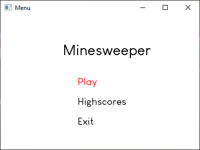
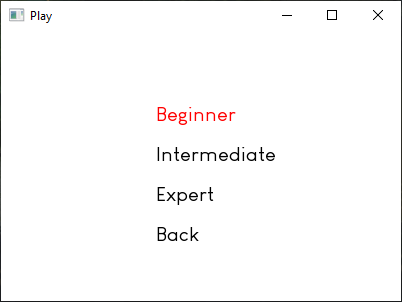
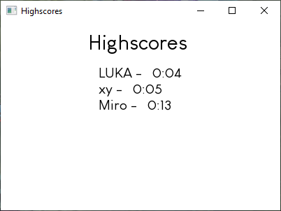
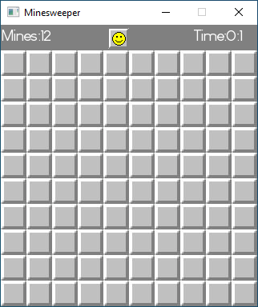
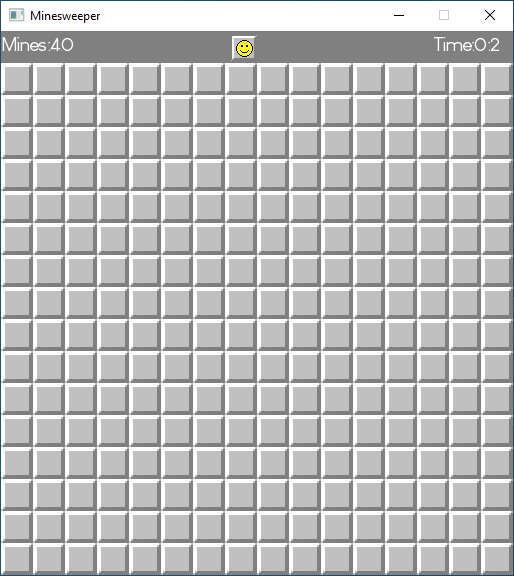
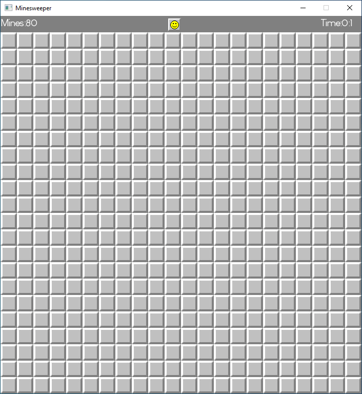

<h1 align="center">Minesweeper</h1>

<h2 align="left">Description</h2>

Minesweeper is a classic single-player puzzle game where the objective is to clear a rectangular board containing hidden mines without detonating any of them. The game is played by revealing cells on the board, with each cell either containing a mine or a number indicating the count of adjacent mines.

This project aims to provide a simple implementation of the Minesweeper game using C++ and SFML.

<h2 align="left">Features</h2>  

- Classic Minesweeper gameplay        
- 3 difficulties: beginner, intermediate, expert    
- Highscores record    

<h2 align="left">Screenshots</h2>









<h2 align="left">Installation</h2>

To download the game you can use:

```bash
git clone https://github.com/MiroTheMighty/Minesweeper.git
```

or you can go to <>Code->Download ZIP.  

Afterwards go to Release->Minesweeper.exe

<h2 align="left">Controls</h2>

Main menu:  
- Up arrow and down arrow used for navigation  
- Enter key used for selecting an option  
Menu options:  
  - Highscores:  
    - shows the highscores  
    - Enter or escape to return to main menu  
  - Play:  
    - Opens a sub menu with game dificulty options  
    - Beginner - 10x10 field with 12 mines  
    - Intermediate - 16x16 field with 40 mines  
    - Expert - 22x22 field with 80 mines  
    - Back or escape - return to main menu  
  - Exit:  
    - exits the game
 
Inside minesweeper press enter to restart. Closing the window or pressing escape will open the main menu screen.
